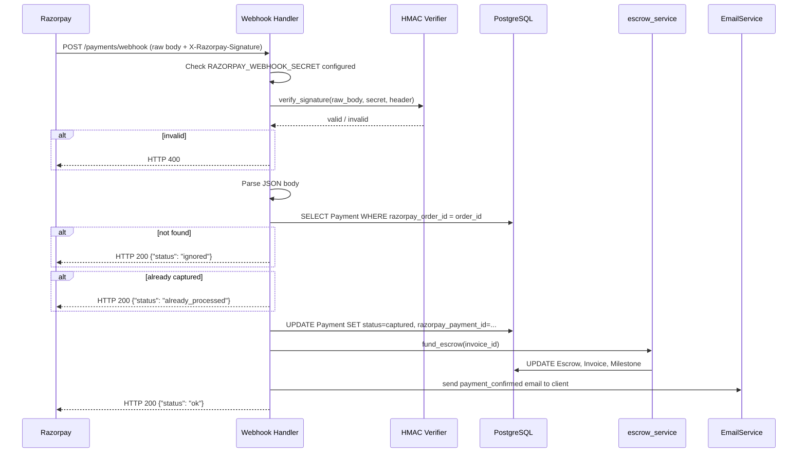
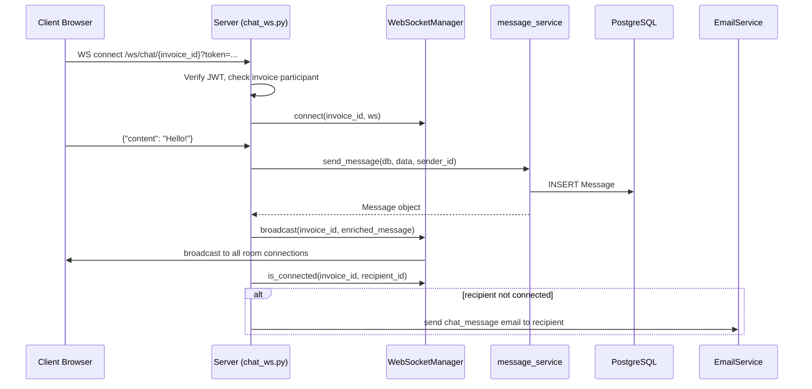

# Design Document: Razorpay Webhook Phase 2

## Overview

Phase 2 adds three production-critical capabilities to PaySure:

1. **Razorpay Webhook Handler** — An async, unauthenticated `POST /payments/webhook` endpoint that verifies HMAC-SHA256 signatures and idempotently processes `payment.captured`, `payment.failed`, and `refund.processed` events. This closes the browser-close gap where escrow was never funded if the user navigated away mid-payment.

2. **Real-Time WebSocket Chat** — A `WS /ws/chat/{invoice_id}` endpoint backed by an in-process `WebSocketManager` that replaces the 5-second polling loop in `InvoiceDetailPage.jsx` with persistent, per-room connections.

3. **Email Notifications** — A pluggable `EmailService` with SendGrid and Resend adapters, triggered at key lifecycle events (milestone submitted/released, dispute raised, payment confirmed, chat message when recipient is offline).

All three features are additive — no existing endpoints are modified, only new modules are introduced and existing services are extended with notification hooks.

---

## Architecture

```mermaid
graph TD
    subgraph External
        RZ[Razorpay]
        SG[SendGrid / Resend]
    end

    subgraph Frontend
        IDP[InvoiceDetailPage.jsx]
        WSC[useWebSocketChat hook]
    end

    subgraph Backend - FastAPI
        WH[POST /payments/webhook]
        WSE[WS /ws/chat/{invoice_id}]
        API[Existing REST API]

        subgraph Services
            HV[HMAC Verifier]
            WM[WebSocketManager]
            ES[EmailService]
            MS[message_service.py]
            ESC[escrow_service.py]
            MLS[milestone_service.py]
        end
    end

    subgraph Database
        DB[(PostgreSQL)]
    end

    RZ -->|POST webhook| WH
    WH --> HV
    HV -->|verified| WH
    WH --> ESC
    WH --> ES

    IDP --> WSC
    WSC <-->|WebSocket| WSE
    WSE --> WM
    WM --> MS
    WM --> ES

    API --> MLS
    API --> ESC
    MLS --> ES
    ESC --> ES

    MS --> DB
    ESC --> DB
    MLS --> DB

    ES -->|HTTP| SG
```

### Key Design Decisions

- **WebSocketManager is in-process** — A single `WebSocketManager` singleton lives in the FastAPI process. This is appropriate for a single-server deployment. If horizontal scaling is needed later, the manager can be backed by Redis pub/sub without changing the interface.
- **Email is fire-and-forget** — All email sends are wrapped in try/except and never raise. This ensures email failures never interrupt the primary request flow.
- **Webhook endpoint bypasses Clerk auth** — The webhook route is registered directly on the FastAPI app (not under the authenticated `api_router`) so Razorpay can call it without a JWT.
- **Raw body is read before JSON parsing** — FastAPI's `Request` object is used directly to read raw bytes for HMAC verification before Pydantic schema parsing.

---

## Components and Interfaces

### 1. Webhook Handler (`backend/app/api/v1/webhook.py`)

New file. Registers `POST /payments/webhook` outside the authenticated router.

```python
# Pseudo-interface
async def razorpay_webhook(request: Request, db: Session) -> JSONResponse:
    # 1. Check RAZORPAY_WEBHOOK_SECRET configured → 503 if not
    # 2. Read raw body bytes
    # 3. Verify HMAC-SHA256 signature → 400 if invalid/missing
    # 4. Parse JSON body
    # 5. Dispatch to event handler based on event type
    # 6. Return HTTP 200
```

### 2. HMAC Verifier (`backend/app/services/webhook_service.py`)

New file. Pure functions for signature verification and event dispatch.

```python
def verify_razorpay_signature(raw_body: bytes, secret: str, signature: str) -> bool:
    """Constant-time HMAC-SHA256 comparison."""

def handle_payment_captured(db: Session, payload: dict) -> dict:
    """Idempotent handler for payment.captured events."""

def handle_payment_failed(db: Session, payload: dict) -> dict:
    """Idempotent handler for payment.failed events."""

def handle_refund_processed(db: Session, payload: dict) -> dict:
    """Handler for refund.processed events."""
```

### 3. WebSocketManager (`backend/app/services/websocket_manager.py`)

New file. In-process connection registry.

```python
class WebSocketManager:
    def __init__(self):
        self._rooms: dict[str, list[WebSocket]] = {}

    async def connect(self, invoice_id: str, ws: WebSocket) -> None: ...
    def disconnect(self, invoice_id: str, ws: WebSocket) -> None: ...
    async def broadcast(self, invoice_id: str, message: dict) -> None: ...
    def is_connected(self, invoice_id: str, user_id: str) -> bool: ...

# Module-level singleton
manager = WebSocketManager()
```

### 4. WebSocket Endpoint (`backend/app/api/v1/chat_ws.py`)

New file. Handles WebSocket upgrade, auth, and message loop.

```python
@router.websocket("/ws/chat/{invoice_id}")
async def websocket_chat(
    invoice_id: UUID,
    websocket: WebSocket,
    token: str = Query(...),
    db: Session = Depends(get_db),
): ...
```

Authentication is passed as a query parameter (`?token=<clerk_jwt>`) since WebSocket upgrade requests cannot carry custom headers in browsers.

### 5. EmailService (`backend/app/services/email_service.py`)

New file. Pluggable provider with SendGrid and Resend adapters.

```python
class EmailService:
    def send(self, to: str, subject: str, html_body: str) -> None:
        """Fire-and-forget. Never raises."""

class SendGridAdapter:
    def send(self, to: str, subject: str, html_body: str) -> None: ...

class ResendAdapter:
    def send(self, to: str, subject: str, html_body: str) -> None: ...

def get_email_service() -> EmailService:
    """Factory — reads EMAIL_PROVIDER env var."""
```

### 6. Notification Triggers

Notification calls are added to existing service functions:

| Trigger point | File | Notification |
|---|---|---|
| `submit_milestone()` | `milestone_service.py` | Email client: milestone submitted |
| `release_milestone_payment()` | `escrow_service.py` | Email freelancer: milestone released |
| `create_dispute()` | `dispute_service.py` | Email both parties: dispute raised |
| `fund_escrow()` | `escrow_service.py` | Email client: payment confirmed |
| WebSocket message received | `chat_ws.py` | Email other participant if not connected |

### 7. Frontend WebSocket Hook (`frontend/src/hooks/useWebSocketChat.js`)

New file. Encapsulates WebSocket lifecycle, reconnect logic, and message state.

```javascript
function useWebSocketChat(invoiceId, { enabled, getToken, onMessage }) {
  // Returns: { connected, messages, sendMessage }
}
```

---

## Data Models

No new database tables are required. The existing `Payment` model already has all fields needed for webhook processing. The `WebSocketManager` state is in-process only (not persisted).

### Config additions (`backend/app/core/config.py`)

Two new optional settings:

```python
EMAIL_PROVIDER: str = ""   # "sendgrid" | "resend" | "" (no-op)
EMAIL_FROM: str = ""       # e.g. "noreply@paysure.app"
SENDGRID_API_KEY: str = ""
RESEND_API_KEY: str = ""
FRONTEND_URL: str = "http://localhost:5173"  # for email deep links
```

### Webhook Payload Shape (Razorpay)

```
payment.captured:
  event: "payment.captured"
  payload.payment.entity.order_id: str
  payload.payment.entity.id: str

payment.failed:
  event: "payment.failed"
  payload.payment.entity.order_id: str

refund.processed:
  event: "refund.processed"
  payload.refund.entity.payment_id: str
  payload.refund.entity.amount: int  (paise)
```

### WebSocket Message Protocol

Client → Server:
```json
{ "content": "Hello!", "file_url": null, "file_name": null }
```

Server → Client (broadcast):
```json
{
  "id": "uuid",
  "invoice_id": "uuid",
  "sender_id": "uuid",
  "sender_name": "Alice",
  "sender_role": "client",
  "content": "Hello!",
  "file_url": null,
  "file_name": null,
  "created_at": "2024-01-01T00:00:00Z"
}
```

---

## Data Flow Diagrams

### Webhook: payment.captured



### WebSocket: Message Send



---

## New Files to Create

| Path | Purpose |
|---|---|
| `backend/app/services/webhook_service.py` | HMAC verification + event handlers |
| `backend/app/api/v1/webhook.py` | FastAPI route for POST /payments/webhook |
| `backend/app/services/websocket_manager.py` | In-process WebSocket connection registry |
| `backend/app/api/v1/chat_ws.py` | WebSocket endpoint + message loop |
| `backend/app/services/email_service.py` | EmailService + SendGrid/Resend adapters |
| `frontend/src/hooks/useWebSocketChat.js` | React hook for WebSocket chat |

## Changes to Existing Files

| Path | Change |
|---|---|
| `backend/app/main.py` | Register webhook route + WebSocket route outside auth router; mount WebSocket router |
| `backend/app/api/v1/routes.py` | Import and include `chat_ws` router |
| `backend/app/core/config.py` | Add `EMAIL_PROVIDER`, `EMAIL_FROM`, `SENDGRID_API_KEY`, `RESEND_API_KEY`, `FRONTEND_URL` |
| `backend/app/services/milestone_service.py` | Call `email_service.notify_milestone_submitted()` in `submit_milestone()` |
| `backend/app/services/escrow_service.py` | Call `email_service.notify_payment_confirmed()` in `fund_escrow()` and `email_service.notify_milestone_released()` in `release_milestone_payment()` |
| `backend/app/services/dispute_service.py` | Call `email_service.notify_dispute_raised()` in dispute creation |
| `frontend/src/pages/InvoiceDetailPage.jsx` | Replace polling loop with `useWebSocketChat` hook; add connection indicator |

---

## Correctness Properties

*A property is a characteristic or behavior that should hold true across all valid executions of a system — essentially, a formal statement about what the system should do. Properties serve as the bridge between human-readable specifications and machine-verifiable correctness guarantees.*

### Property 1: HMAC Signature Verification Accepts Valid Signatures

*For any* raw body bytes and any webhook secret string, computing `HMAC-SHA256(body, secret)` and passing the result as the `X-Razorpay-Signature` header should result in the signature being accepted by the verifier.

**Validates: Requirements 2.2, 2.5**

---

### Property 2: HMAC Signature Verification Rejects Invalid Signatures

*For any* raw body bytes and any signature string that is not the correct `HMAC-SHA256(body, secret)`, the verifier should reject the signature and return HTTP 400.

**Validates: Requirements 2.4**

---

### Property 3: Webhook Idempotency

*For any* valid webhook event payload (`payment.captured`, `payment.failed`, or `refund.processed`), processing it N times (N ≥ 1) should produce the same final `Payment` status and `Escrow` state as processing it exactly once.

**Validates: Requirements 3.4, 4.4, 7.1, 7.2, 7.3**

---

### Property 4: Unknown Event Types Are Ignored

*For any* event type string that is not in `["payment.captured", "payment.failed", "refund.processed"]`, the webhook handler should return HTTP 200 with `{"status": "ignored"}` without modifying any database records.

**Validates: Requirements 6.1**

---

### Property 5: WebSocket Authorization Rejects Non-Participants

*For any* invoice and any user who is neither the `client_id` nor the `freelancer_id` of that invoice, attempting to connect to `WS /ws/chat/{invoice_id}` should result in the connection being closed with code 4003.

**Validates: Requirements 8.2, 8.3**

---

### Property 6: WebSocket Registry Connect/Disconnect Round-Trip

*For any* invoice room, after a WebSocket connection is established the connection should appear in the room registry; after the connection is closed the connection should no longer appear in the room registry.

**Validates: Requirements 8.4, 8.5**

---

### Property 7: Message Broadcast Reaches All Room Connections

*For any* message sent by a participant in an invoice room, all currently connected WebSocket clients in that room (including the sender) should receive the broadcast.

**Validates: Requirements 9.2, 9.3**

---

### Property 8: Chat Message Persistence Round-Trip

*For any* message content sent over WebSocket, the message should be retrievable from the database with the same content and correct sender metadata.

**Validates: Requirements 9.1**

---

### Property 9: Email Notification Content Completeness

*For any* notification event (milestone submitted, milestone released, dispute raised, payment confirmed, chat message), the generated email body should contain all required fields specified for that event type (titles, amounts, sender names, deep links).

**Validates: Requirements 12.2, 13.2, 14.2, 15.2, 16.3**

---

### Property 10: Chat Email Suppressed When Recipient Is Connected

*For any* chat message sent in an invoice room, if the recipient has an active WebSocket connection in that room, no email notification should be dispatched to the recipient. If the recipient is not connected, an email should be dispatched.

**Validates: Requirements 16.1, 16.2**

---

### Property 11: Email Failures Do Not Propagate

*For any* email send attempt where the underlying provider raises an exception, the `EmailService.send()` method should not propagate the exception to the caller.

**Validates: Requirements 11.4**

---

## Error Handling

### Webhook Handler

| Condition | Response |
|---|---|
| `RAZORPAY_WEBHOOK_SECRET` not configured | HTTP 503 `{"detail": "Webhook secret not configured"}` |
| `X-Razorpay-Signature` header absent | HTTP 400 `{"detail": "Missing signature header"}` |
| Signature mismatch | HTTP 400 `{"detail": "Signature verification failed"}` |
| `order_id` not found in DB | HTTP 200 `{"status": "ignored", "reason": "order not found"}` |
| Payment already processed | HTTP 200 `{"status": "already_processed"}` |
| `fund_escrow()` raises "already funded" | Log warning, HTTP 200 `{"status": "ok"}` |
| Unknown event type | HTTP 200 `{"status": "ignored"}` |
| Unexpected exception | Log error, HTTP 200 (never let Razorpay retry on our bugs) |

### WebSocket

| Condition | Behavior |
|---|---|
| Invalid/expired JWT token | Close with code 4001 "Invalid token" |
| User not invoice participant | Close with code 4003 "Not authorized" |
| Invoice not found | Close with code 4004 "Invoice not found" |
| Stale connection during broadcast | Remove from registry, continue broadcast to others |
| Malformed JSON message from client | Send error frame, keep connection open |

### Email Service

| Condition | Behavior |
|---|---|
| `EMAIL_PROVIDER` unset | Log at DEBUG level, skip send (no-op) |
| Provider API error | Log at ERROR level, swallow exception |
| Missing recipient email | Log at WARNING level, skip send |

---

## Testing Strategy

### Unit Tests

Focus on pure functions and isolated service logic:

- `verify_razorpay_signature()` — correct/incorrect signatures, missing header
- `WebSocketManager` — connect/disconnect/broadcast with mock WebSocket objects
- `EmailService` — provider selection, no-op mode, exception swallowing
- Email template rendering — content completeness for each notification type
- Webhook event handlers — state transitions with mocked DB sessions

### Property-Based Tests

Using **Hypothesis** (Python) for backend and **fast-check** (JS) for frontend.

Each property test runs a minimum of **100 iterations**.

Tag format: `# Feature: razorpay-webhook-phase2, Property N: <property_text>`

| Property | Test approach |
|---|---|
| P1: HMAC accepts valid signatures | Generate random `body: bytes` and `secret: str`; compute expected HMAC; assert verifier accepts |
| P2: HMAC rejects invalid signatures | Generate random `body: bytes` and `wrong_sig: str` (not equal to correct HMAC); assert verifier rejects |
| P3: Webhook idempotency | Generate valid event payloads; process 2–5 times; assert final DB state equals single-processing state |
| P4: Unknown events ignored | Generate random event type strings not in known set; assert 200 + ignored + no DB changes |
| P5: WS rejects non-participants | Generate random user/invoice pairs where user is not participant; assert close code 4003 |
| P6: WS registry round-trip | Generate random invoice IDs; connect then disconnect; assert registry state |
| P7: Broadcast reaches all | Generate N mock connections in a room; send message; assert all N received it |
| P8: Message persistence | Generate random message content; send via WS; query DB; assert content matches |
| P9: Email content completeness | Generate random notification event data; render email; assert all required fields present |
| P10: Chat email suppression | Generate random room state (connected/not connected); send message; assert email sent iff recipient not connected |
| P11: Email failures don't propagate | Generate any exception type from provider mock; assert EmailService.send() returns normally |

### Integration Tests

- End-to-end webhook flow: real DB, mocked Razorpay signature
- WebSocket connect/message/disconnect with TestClient
- Email provider selection with mocked HTTP calls

### Frontend Tests

- `useWebSocketChat` hook: connection lifecycle, message appending, reconnect backoff (fast-check)
- `InvoiceDetailPage`: chat tab shows connection indicator, no polling interval registered
